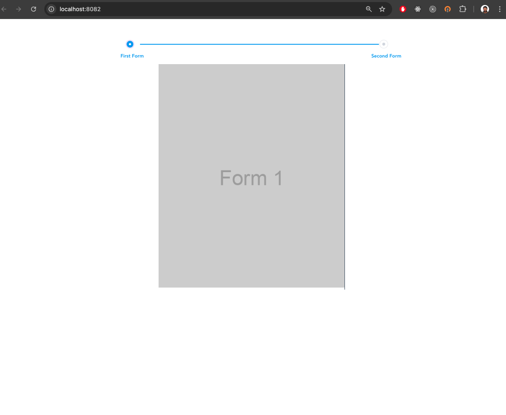

# Vue Stepper

A simple Vue 2 project that demonstrates a reusable stepper component with conditional rendering of images based on the current step. This project uses Vue CLI and showcases how to handle steps dynamically using props and emits.

## Project Structure

- **App.vue**: The main component that includes the stepper and displays images based on the step.
- **components/StepperVue.vue**: The reusable stepper component that handles step navigation.

## Features

- Reusable stepper component
- Conditional rendering of images based on the current step
- Dynamic step data binding using Vue's `v-model`


## Screenshot



## Getting Started

These instructions will help you set up the project locally.

### Prerequisites

- Node.js (version 12.x or higher recommended)
- npm (version 6.x or higher)
- Vue CLI

### Installation

1. **Clone the repository:**

    ```bash
    git clone https://github.com/osamahkenawy/vue-stepper.git
    cd vue-stepper
    ```

2. **Install dependencies:**

    ```bash
    npm install
    ```

### Running the Project

To run the project locally, use the following command:

```bash
npm run serve